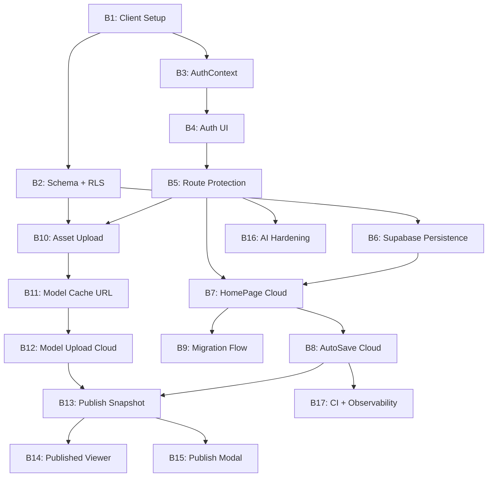

# Backend MVP - Development Coordination Plan

## How to Use This Plan

This plan divides the Backend MVP into discrete tasks. Each task:

- Has a **clear scope** with specific files to create/modify
- Lists **dependencies** that must be completed first
- Defines **deliverables** — what "done" looks like
- Provides **context** an agent needs to pick up the work
- Lists **non-negotiable guardrails** that must not be violated

When starting a task, the agent should:

1. Read this plan file
2. Read `.cursor/rules/backend-security.mdc` (security invariants)
3. Read the relevant ADRs in `docs/adr/` if the task touches architecture
4. Update this file's frontmatter `status` to `in_progress` before starting
5. Update to `completed` when done

---

## References (read before any task)

- **Main backend plan**: `.cursor/plans/backend_mvp_plan_9d2b1c3e.plan.md`
- **Security rules**: `.cursor/rules/backend-security.mdc`
- **ADRs**: `docs/adr/`
- **Preflight checklist**: `BACKEND_MVP_CHECKLIST.md`
- **Style guide**: `STYLE_GUIDE.md` (for any UI work)
- **Project rules**: `.cursorrules`

---

## Non-negotiable Guardrails (every task)

1. **No secrets in the browser** — never ship service-role keys, OpenAI keys, or DB passwords to the client.
2. **RLS enforces ownership** — never rely on "the frontend filters it."
3. **Validate external inputs** — all API inputs must be schema-validated.
4. **Starter models (`starter:*`) are app-bundled** — do not upload them to cloud storage.
5. **Keep MVP scope** — no teams, no billing, no realtime collab.

---

## Task Dependency Graph




---

## Task Breakdown

---

### B1: Supabase Client Setup

**Priority**: First
**Estimated Complexity**: Low
**Dependencies**: None
**Recommended Model**: Fast

**Scope**:

- Install `@supabase/supabase-js`
- Create the Supabase client singleton
- Update environment variable documentation

**Files to Create**:

```
src/lib/supabase.ts
```

**Files to Modify**:

```
.env.example        — add VITE_SUPABASE_URL + VITE_SUPABASE_ANON_KEY
package.json         — add @supabase/supabase-js dependency
```

**Deliverables**:

```typescript
// src/lib/supabase.ts
import { createClient } from '@supabase/supabase-js';

const supabaseUrl = import.meta.env.VITE_SUPABASE_URL;
const supabaseAnonKey = import.meta.env.VITE_SUPABASE_ANON_KEY;

if (!supabaseUrl || !supabaseAnonKey) {
  throw new Error('Missing Supabase environment variables');
}

export const supabase = createClient(supabaseUrl, supabaseAnonKey);
```

Updated `.env.example` with:

```
VITE_SUPABASE_URL=
VITE_SUPABASE_ANON_KEY=
```

**Context for Agent**:

- The anon key is **safe for the browser** (it's a publishable key). The service role key must NEVER appear here.
- Follow existing patterns in `.env.example` for documentation style.
- Do NOT add any Supabase service role key references to the client code.

---

### B2: DB Migrations — Tables, RLS Policies, Storage Buckets

**Priority**: First (security-critical)
**Estimated Complexity**: High
**Dependencies**: B1
**Recommended Model**: More capable (security-sensitive)

**Scope**:

- Write SQL migration files for all three tables
- Write RLS policies that enforce ownership
- Define storage bucket policies
- Document all policies in comments

**Files to Create**:

```
supabase/migrations/001_create_projects.sql
supabase/migrations/002_create_assets.sql
supabase/migrations/003_create_published_projects.sql
supabase/migrations/004_storage_buckets.sql
```

**Files to Reference**:

- `docs/adr/0002-project-storage-jsonb.md` — project data shape
- `docs/adr/0003-publish-snapshot-token.md` — published snapshot model
- `docs/adr/0004-asset-storage-direct-upload.md` — storage layout
- `docs/adr/0005-security-rls-first.md` — RLS approach
- `src/types/project.ts` — Project type (the data shape stored in JSONB)
- `src/types.ts` — SceneObject, SimStep
- `src/types/model.ts` — AssetMetadata, ModelMetrics

**Deliverables**:

Tables:

- `projects` — `id`, `owner_id`, `name`, `data (jsonb)`, `thumbnail_url`, `created_at`, `updated_at`, `deleted_at`
- `assets` — `id`, `owner_id`, `project_id`, `storage_key`, `filename`, `file_type`, `file_size`, `metadata (jsonb)`, `created_at`
- `published_projects` — `id`, `project_id`, `owner_id`, `share_token (unique)`, `snapshot (jsonb)`, `is_active`, `created_at`, `updated_at`

RLS Policies (must be exactly these):

- `projects`: owner can SELECT/INSERT/UPDATE/DELETE where `auth.uid() = owner_id`
- `assets`: owner can SELECT/INSERT/UPDATE/DELETE where `auth.uid() = owner_id`
- `published_projects`: owner can SELECT/INSERT/UPDATE/DELETE where `auth.uid() = owner_id`; **anyone** can SELECT where `is_active = true` (for public viewer, filtered by share_token in query)

Storage Buckets:

- `user-assets` (private) — owner-only upload/download
- `thumbnails` (private) — owner-only upload/download
- `published-assets` (public) — anyone can read; only server/owner can write

**Critical Security Notes**:

- RLS must be **enabled** on every table (not just "policies exist" — the table itself must have RLS toggled on).
- The `published_projects` public SELECT policy must NOT expose `owner_id` or any user info unnecessarily. Prefer returning only `snapshot`, `share_token`, `is_active`.
- Test that a user CANNOT read another user's projects even by guessing the UUID.

---

### B3: AuthContext + useAuth Hook

**Priority**: High
**Estimated Complexity**: Medium
**Dependencies**: B1
**Recommended Model**: More capable

**Scope**:

- Create React Context for auth state
- Create custom hook for consuming auth
- Handle Supabase auth state changes (onAuthStateChange)
- Persist session automatically (Supabase handles this)

**Files to Create**:

```
src/contexts/AuthContext.tsx
```

**Files to Reference**:

- `src/contexts/PopupContext.tsx` — existing context pattern
- `src/contexts/GuidedWorkflowContext.tsx` — another context example
- `src/lib/supabase.ts` — Supabase client (from B1)

**Deliverables**:

```typescript
// Shape of the context value
interface AuthContextValue {
  user: User | null;           // Supabase User object
  session: Session | null;     // Supabase Session
  isLoading: boolean;          // true while checking initial session
  signUp: (email: string, password: string) => Promise<{ error: Error | null }>;
  signIn: (email: string, password: string) => Promise<{ error: Error | null }>;
  signOut: () => Promise<void>;
}
```

- `AuthProvider` component that wraps the app
- `useAuth()` hook that returns `AuthContextValue`
- Automatically listens to `supabase.auth.onAuthStateChange`
- `isLoading` starts as `true` and becomes `false` after initial session check

**Context for Agent**:

- Follow the same Provider/hook pattern as `PopupContext.tsx`
- Supabase persists the session in localStorage automatically — do NOT add custom localStorage logic
- The `User` and `Session` types come from `@supabase/supabase-js`

---

### B4: Auth UI — Sign In / Sign Up Page

**Priority**: High
**Estimated Complexity**: Medium
**Dependencies**: B3
**Recommended Model**: Fast (UI-focused)

**Scope**:

- Create a minimal sign-in / sign-up page
- Email + password only (no OAuth for MVP)
- Follow the app's glass panel design system
- Handle errors (invalid email, wrong password, etc.)

**Files to Create**:

```
src/pages/AuthPage.tsx
```

**Files to Modify**:

```
src/App.tsx — add /auth route
```

**Files to Reference**:

- `STYLE_GUIDE.md` — glass panel styling, button variants, typography
- `src/components/PublishModal.tsx` — input/button patterns
- `src/contexts/AuthContext.tsx` — useAuth hook (from B3)

**Deliverables**:

- Page at `/auth` with:
  - Toggle between "Sign In" and "Sign Up" modes
  - Email input + password input
  - Submit button (primary style)
  - Error display for validation / auth failures
  - Loading state during auth call
- After successful sign-in/up: redirect to `/` (HomePage)
- Follows glass panel aesthetic (centered card, backdrop blur)

**UI Specification**:

```
+------------------------------------------+
|                                          |
|         Welcome to Facilitate            |
|                                          |
|   Email                                  |
|   [________________________]             |
|                                          |
|   Password                               |
|   [________________________]             |
|                                          |
|        [ Sign In ]                       |
|                                          |
|   Don't have an account? Sign up         |
|                                          |
+------------------------------------------+
```

**Context for Agent**:

- Keep it minimal — no fancy animations, no social auth
- Use existing Tailwind utility classes from the project
- Error messages should be user-friendly, not technical

---

### B5: Route Protection + Sign-Out UX

**Priority**: High
**Estimated Complexity**: Low
**Dependencies**: B4
**Recommended Model**: Fast

**Scope**:

- Protect editor and home routes (require auth)
- Keep `/published` route public (no auth required)
- Add sign-out button to HomePage and editor TopBar
- Redirect unauthenticated users to `/auth`

**Files to Modify**:

```
src/App.tsx                          — wrap routes with auth check
src/pages/HomePage.tsx               — add sign-out button + user indicator
src/components/TopBar.tsx            — add sign-out button (if TopBar exists)
```

**Files to Reference**:

- `src/App.tsx` — current routing structure
- `src/contexts/AuthContext.tsx` — useAuth hook (from B3)

**Deliverables**:

- `/` and `/editor/*` and `/preview/*` routes: redirect to `/auth` if not signed in
- `/published` route: remains public (no auth check)
- `/auth` route: redirect to `/` if already signed in
- Sign-out button visible on HomePage (subtle, e.g. top-right)
- Sign-out button in editor TopBar (if present)
- `useAuth().isLoading` shows a loading spinner, not a flash of auth page

**Context for Agent**:

- Do NOT block the `/published` route — published simulations must be viewable without an account
- The auth loading state should show a simple centered spinner (same as existing app loading pattern)

---

### B6: Supabase Persistence Adapter for Projects

**Priority**: High
**Estimated Complexity**: Medium
**Dependencies**: B2
**Recommended Model**: More capable

**Scope**:

- Create a new persistence implementation that talks to Supabase
- Match the interface of the existing `IndexedDBProjectPersistence`
- Handle the `Project` JSON serialization (objects + steps go into `data` column)

**Files to Create**:

```
src/persistence/supabasePersistence.ts
```

**Files to Reference**:

- `src/persistence/projectPersistence.ts` — existing IndexedDB implementation (match this interface)
- `src/types/project.ts` — Project and ProjectMetadata types
- `src/lib/supabase.ts` — Supabase client (from B1)

**Deliverables**:

```typescript
// Must implement the same operations as IndexedDBProjectPersistence:
class SupabaseProjectPersistence {
  async loadProjects(): Promise<Project[]>             // SELECT metadata, sorted by updated_at
  async getProject(id: string): Promise<Project | undefined>  // SELECT full project by id
  async saveProject(project: Project): Promise<void>   // UPSERT (insert or update)
  async deleteProject(id: string): Promise<void>       // UPDATE set deleted_at (soft delete)
}
```

- `loadProjects()` should return metadata only (id, name, dates, thumbnail_url) for performance — full `data` blob loaded only by `getProject()`
- `saveProject()` must split the Project into: metadata columns + `data` JSONB column
- `deleteProject()` should soft-delete (set `deleted_at`, not hard delete)
- All queries rely on RLS (no manual `WHERE owner_id = ...` needed if using Supabase client with session)

**Critical Notes**:

- The `data` JSONB column stores `{ objects, steps }` — do NOT store the full `Project` type (avoid duplicating `id`, `name`, etc. inside JSONB)
- Thumbnail: for now, store as `thumbnail_url` column (URL to storage). Base64 thumbnails from IndexedDB should be uploaded to storage in B8.

---

### B7: Wire HomePage + useProjects to Cloud

**Priority**: High
**Estimated Complexity**: Medium
**Dependencies**: B5, B6
**Recommended Model**: Fast

**Scope**:

- Switch `useProjects` hook to use Supabase persistence when authenticated
- Update HomePage to show cloud projects
- Keep existing functionality (create, delete, navigate to editor)

**Files to Modify**:

```
src/hooks/useProjects.ts         — use SupabaseProjectPersistence
src/pages/HomePage.tsx           — load from cloud, show loading states
```

**Files to Reference**:

- `src/persistence/supabasePersistence.ts` — new persistence (from B6)
- `src/persistence/projectPersistence.ts` — old persistence (keep as fallback reference)

**Deliverables**:

- `useProjects` hook loads project list from Supabase (metadata: id, name, dates, thumbnail)
- HomePage shows cloud projects with existing card UI
- Create project → inserts into Supabase
- Delete project → soft deletes in Supabase
- Navigate to editor → passes project ID
- Loading states while fetching from Supabase
- Error states if network fails

**Context for Agent**:

- The HomePage currently loads ALL projects into memory. For cloud, this is fine for MVP (users won't have thousands). No pagination needed yet.
- Keep the existing `ProjectCard` UI components — just change the data source.

---

### B8: Wire Auto-Save + Thumbnail Upload to Cloud

**Priority**: High
**Estimated Complexity**: Medium
**Dependencies**: B7
**Recommended Model**: More capable

**Scope**:

- Update the auto-save hook to save to Supabase
- Upload thumbnails to Supabase Storage instead of storing base64 in project
- Increase debounce slightly for network saves

**Files to Modify**:

```
src/hooks/useProjectAutoSave.ts    — save to Supabase, upload thumbnail
src/hooks/editor/useEditorProjectLifecycle.ts — load project from Supabase
```

**Files to Reference**:

- `src/hooks/useProjectAutoSave.ts` — current auto-save implementation
- `src/hooks/editor/useEditorProjectLifecycle.ts` — current project loading
- `src/utils/captureThumbnail.ts` — thumbnail capture (returns base64)
- `src/persistence/supabasePersistence.ts` — Supabase persistence (from B6)

**Deliverables**:

- Auto-save writes to Supabase (debounce increased to 2–3s)
- Thumbnail captured → uploaded to `thumbnails` bucket → URL stored in `thumbnail_url`
- Editor loads project from Supabase on mount (via `getProject(id)`)
- Add retry logic for failed saves (at least 1 retry with backoff)
- Save status indicator still works (`idle`, `dirty`, `saving`, `saved`, `error`)

**Critical Notes**:

- Thumbnail upload is a separate storage operation — don't block the project save on it
- If thumbnail upload fails, save the project anyway (thumbnail is nice-to-have, not critical)
- The `serializeSnapshot()` comparison (dirty detection) should still work the same way

---

### B9: Local-to-Cloud Project Migration Flow

**Priority**: Medium
**Estimated Complexity**: Medium
**Dependencies**: B7
**Recommended Model**: Fast

**Scope**:

- Detect local IndexedDB projects on first cloud login
- Offer one-time "Import local projects to your account" action
- Upload local projects to Supabase
- Skip starter model assets during migration

**Files to Create**:

```
src/components/LocalProjectMigration.tsx
```

**Files to Modify**:

```
src/pages/HomePage.tsx — show migration prompt when local projects detected
```

**Files to Reference**:

- `src/persistence/projectPersistence.ts` — IndexedDB persistence (read local projects)
- `src/persistence/supabasePersistence.ts` — Supabase persistence (write to cloud)
- `STYLE_GUIDE.md` — UI styling

**Deliverables**:

- On HomePage mount (when authenticated): check IndexedDB for local projects
- If found: show banner/modal: "We found X projects saved locally. Import them to your account?"
- "Import" button: uploads each project to Supabase, shows progress
- "Dismiss" button: hides banner (store dismissal in localStorage so it doesn't reappear)
- Handle partial failures gracefully (some succeed, some fail → show which failed)
- Do NOT delete local copies after import (user can clear manually)

**Context for Agent**:

- This is a one-time migration, not an ongoing sync
- Don't migrate `starter:*` assets — they're app-bundled
- Keep the UI simple: a banner at the top of HomePage, or a small modal

---

### B10: Cloud Asset Upload + Storage Bucket Wiring

**Priority**: High
**Estimated Complexity**: Medium-High
**Dependencies**: B2, B5
**Recommended Model**: More capable

**Scope**:

- Wire model uploads to Supabase Storage (`user-assets` bucket)
- Record asset metadata in the `assets` table
- Keep local IndexedDB as a cache layer

**Files to Create**:

```
src/utils/cloudAssetStore.ts
```

**Files to Modify**:

```
src/utils/modelAssetStore.ts — add cloud upload/download functions alongside local
```

**Files to Reference**:

- `src/utils/modelAssetStore.ts` — current IndexedDB asset store
- `src/types/model.ts` — AssetMetadata, ModelMetrics, ModelFileType
- `src/lib/supabase.ts` — Supabase client
- `docs/adr/0004-asset-storage-direct-upload.md` — storage path conventions

**Deliverables**:

```typescript
// src/utils/cloudAssetStore.ts
export async function uploadAssetToCloud(
  file: File | Blob,
  userId: string,
  assetId: string,
  metadata: { filename: string; fileType: ModelFileType; fileSize: number }
): Promise<{ storageKey: string }>

export async function downloadAssetFromCloud(
  storageKey: string
): Promise<Blob>

export async function getAssetSignedUrl(
  storageKey: string
): Promise<string>

export async function deleteCloudAsset(
  storageKey: string,
  assetId: string
): Promise<void>
```

- Storage path: `{userId}/{assetId}/{filename}`
- After upload: insert row into `assets` table with `storage_key`, metadata
- Download: returns blob (for preprocessing client-side)
- Also cache downloaded blobs in IndexedDB for offline/fast reloads

**Critical Notes**:

- File type validation: only allow `glb`, `fbx`, `obj` extensions
- Max file size: 100MB (enforce client-side AND via storage bucket policy)
- Do NOT upload `starter:*` assets to cloud

---

### B11: Model Cache URL Fallback — Load Models from Cloud

**Priority**: High
**Estimated Complexity**: High (touches rendering pipeline)
**Dependencies**: B10
**Recommended Model**: More capable

**Scope**:

- Update `modelCache.ts` so that `getOrLoadModel()` can load from cloud when an asset is not in IndexedDB
- Add a new `loadModelFromUrl()` utility for URL-based loading
- Support an "asset resolver" pattern for the published viewer (B14)

**Files to Modify**:

```
src/utils/modelCache.ts — add cloud fallback to loadModelInternal()
```

**Files to Create**:

```
src/utils/modelLoaders/loadFromUrl.ts — load a 3D model from a URL
```

**Files to Reference**:

- `src/utils/modelCache.ts` — current cache implementation (the `loadModelInternal` function)
- `src/utils/modelAssetStore.ts` — current `getAsset()` from IndexedDB
- `src/utils/modelLoaders/loadFromArrayBuffer.ts` — ArrayBuffer-based loading (reuse)
- `src/utils/cloudAssetStore.ts` — cloud download (from B10)
- `src/types/model.ts` — ModelFileType

**Deliverables**:

Updated `loadModelInternal()` flow:

1. Check in-memory cache (existing)
2. Check IndexedDB (existing)
3. **NEW**: If not in IndexedDB, check `assets` table for `storage_key`, download from cloud, preprocess, cache locally
4. If all fail, throw error

New utility:

```typescript
// src/utils/modelLoaders/loadFromUrl.ts
export async function loadModelFromUrl(
  url: string,
  fileType: ModelFileType
): Promise<THREE.Group>
```

Also expose an "asset resolver" hook/function for the published viewer:

```typescript
// Optional: a way to inject a custom asset resolver (for published snapshots)
export function setAssetResolver(
  resolver: (assetId: string) => Promise<{ url: string; fileType: ModelFileType }> | null
): void
```

**Critical Notes**:

- This is the most architecturally sensitive task — it touches the rendering pipeline that every model goes through
- The `loadFromUrl` function should: fetch URL → get ArrayBuffer → call existing `loadAndPreprocessModelFromArrayBuffer`
- Keep the existing IndexedDB path working — cloud is a fallback, not a replacement
- For `starter:*` assets: they are already in IndexedDB (seeded on startup) — no cloud fallback needed

---

### B12: Wire useModelUpload to Cloud Storage

**Priority**: Medium
**Estimated Complexity**: Medium
**Dependencies**: B11
**Recommended Model**: Fast

**Scope**:

- Update the upload flow to save to cloud storage + `assets` table
- Keep local IndexedDB as cache
- Keep existing upload UI/UX unchanged

**Files to Modify**:

```
src/hooks/useModelUpload.ts — upload to cloud after local save
src/hooks/modelUpload/useModelUploadInit.ts — load recent assets from cloud
```

**Files to Reference**:

- `src/hooks/useModelUpload.ts` — current upload hook
- `src/utils/cloudAssetStore.ts` — cloud upload (from B10)
- `src/utils/modelAssetStore.ts` — local asset store

**Deliverables**:

- `uploadFile()`: save locally (IndexedDB) + upload to cloud (Supabase Storage + assets table)
- `refreshRecentAssets()`: load from `assets` table (cloud) instead of only IndexedDB
- `removeAsset()`: delete from both local and cloud
- `starterAssets` filtering: unchanged (still uses `getStarterAssetIds()`)
- If cloud upload fails: the asset is still usable locally; show a non-blocking warning

**Context for Agent**:

- The local IndexedDB save should happen FIRST (fast, reliable)
- Cloud upload happens in the background (don't block the UI)
- Recent assets list should come from cloud (authoritative), with local as fallback if offline

---

### B13: Publish Snapshot Creation + Asset Manifest

**Priority**: High (security-sensitive)
**Estimated Complexity**: Medium-High
**Dependencies**: B12, B8
**Recommended Model**: More capable

**Scope**:

- When user publishes: create a snapshot of the project + copy user assets to public bucket + generate asset manifest
- Insert into `published_projects` table with share token
- Handle republishing (update existing snapshot)

**Files to Create**:

```
src/services/publishService.ts
```

**Files to Modify**:

```
src/utils/publishUtils.ts — replace local URL generation with cloud publish
```

**Files to Reference**:

- `src/utils/publishUtils.ts` — current local-only publish
- `src/types/publish.ts` — PublishURLResult type
- `docs/adr/0003-publish-snapshot-token.md` — snapshot + token model
- `src/lib/supabase.ts` — Supabase client

**Deliverables**:

```typescript
// src/services/publishService.ts

interface PublishedSnapshot {
  name: string;
  objects: SceneObject[];
  steps: SimStep[];
  assetManifest: Record<string, {
    url: string;           // public URL in published-assets bucket
    fileType: ModelFileType;
    metrics?: ModelMetrics;
    children?: ChildMesh[];
  }>;
}

export async function publishProject(
  project: Project,
  userId: string
): Promise<{ shareToken: string; url: string }>

export async function unpublishProject(
  projectId: string
): Promise<void>
```

Publish flow:

1. Serialize current project to snapshot JSON
2. For each non-starter asset referenced by `objects[].properties.modelAssetId`:
  - Copy from `user-assets` bucket to `published-assets` bucket (public)
  - Add entry to `assetManifest` with public URL
3. For `starter:*` assets: skip (resolved client-side)
4. Generate high-entropy `share_token` (e.g. `crypto.randomUUID()` or similar)
5. UPSERT into `published_projects` (update if already published)
6. Return share URL: `/published?token={shareToken}`

Updated `publishUtils.ts`:

- `generatePublishURL()` becomes async and calls `publishProject()`
- Returns `{ url, warning: '' }` (no warning needed anymore)

**Critical Security Notes**:

- Share token must be high entropy (UUID v4 minimum)
- Published assets in `published-assets` bucket are **public read** — ensure only non-sensitive model files end up there
- The snapshot must NOT include `owner_id`, user email, or any private info
- Republishing should update the existing `published_projects` row, not create duplicates

---

### B14: Published Viewer Loads from Backend by Share Token

**Priority**: High (most visible MVP change)
**Estimated Complexity**: High
**Dependencies**: B13
**Recommended Model**: More capable

**Scope**:

- Rewrite `PublishedSimulationPage` to load from Supabase by share token
- Use asset manifest to load models from public URLs
- Remove the "only works for creator" warning

**Files to Modify**:

```
src/pages/PublishedSimulationPage.tsx — load from backend instead of IndexedDB
```

**Files to Reference**:

- `src/pages/PublishedSimulationPage.tsx` — current implementation (replace data loading, keep rendering)
- `src/utils/modelCache.ts` — model loading with URL fallback (from B11)
- `src/services/publishService.ts` — PublishedSnapshot type (from B13)
- `src/utils/starterAssets/discoverStarterAssets.ts` — starter asset resolution

**Deliverables**:

Changed URL scheme:

- Old: `/published?projectId={id}` (loads from IndexedDB)
- New: `/published?token={shareToken}` (loads from Supabase)

Updated loading flow:

1. Extract `token` from URL search params
2. Query `published_projects` by `share_token` where `is_active = true` (public RLS allows this)
3. Parse `snapshot` JSONB → `PublishedSnapshot`
4. For models: set up asset resolver that maps `modelAssetId` to manifest URLs
5. For `starter:*` assets: resolve to bundled URLs (existing `discoverStarterAssets`)
6. Render using existing `MainCanvas` + `PreviewStepExecutor` (unchanged)

Error states:

- Invalid/missing token → "This link is invalid"
- Token found but `is_active = false` → "This simulation is no longer available"
- Asset loading failure → graceful degradation (show what loaded, error for missing models)

Remove:

- The old "only works for creator" warning message
- The old `?projectId=` query param handling

**Critical Notes**:

- This page must work **without authentication** (public access)
- Do NOT import `useProjects` or any auth-dependent hooks
- The Supabase query uses the anon key (no session needed) — RLS allows public SELECT on `published_projects` where `is_active = true`

---

### B15: PublishModal UX Update

**Priority**: Medium
**Estimated Complexity**: Low
**Dependencies**: B13
**Recommended Model**: Fast

**Scope**:

- Update PublishModal to call the async publish service
- Show loading state during publish
- Show success with share URL
- Handle errors

**Files to Modify**:

```
src/components/PublishModal.tsx
```

**Files to Reference**:

- `src/components/PublishModal.tsx` — current implementation
- `src/services/publishService.ts` — publish function (from B13)

**Deliverables**:

- "Publish" button triggers async `publishProject()` call
- Loading spinner/state while publishing (copying assets can take time)
- On success: show the share URL (copy button still works)
- On error: show error message with retry option
- "Unpublish" option if already published

**Context for Agent**:

- Keep the existing modal layout — just add loading/error states
- The publish operation may take several seconds (copying assets to public bucket)
- Show progress if possible ("Publishing... Copying assets...")

---

### B16: AI Endpoint Auth + Rate Limiting + Logging

**Priority**: Medium
**Estimated Complexity**: Medium
**Dependencies**: B5
**Recommended Model**: More capable

**Scope**:

- Add auth verification to the AI endpoint
- Add rate limiting (per-user + per-IP fallback)
- Add structured logging

**Files to Modify**:

```
api/ai/extract-steps.ts     — add auth check, rate limiting, logging
dev-server/devApi.mjs        — mirror auth behavior for local dev
src/services/sopService.ts   — send auth token with AI requests
```

**Files to Reference**:

- `api/ai/extract-steps.ts` — current implementation
- `dev-server/devApi.mjs` — current dev server
- `src/services/sopService.ts` — current client-side AI service
- `.cursor/rules/backend-security.mdc` — AI endpoint rules

**Deliverables**:

Auth verification:

- Extract `Authorization: Bearer <token>` header
- Verify JWT using Supabase (either via Supabase client or JWKS verification)
- Return 401 if invalid/missing

Rate limiting:

- Per-user: max 10 requests per minute (configurable via env var)
- Per-IP fallback: max 20 requests per minute
- Return 429 with `Retry-After` header when limited

Logging:

- Log: request ID, user ID, duration, model used, success/failure
- Do NOT log: request body content, API keys, user passwords

Frontend update:

- `sopService.ts`: include Supabase session token in `Authorization` header

**Critical Notes**:

- The Vercel Edge function does not have persistent state — rate limiting may need Vercel KV or a simple in-memory approach with caveats
- For MVP, a simple in-memory rate limiter per Edge function instance is acceptable (not perfect, but blocks casual abuse)

---

### B17: CI Pipeline + Integration Tests + Error Tracking

**Priority**: Final
**Estimated Complexity**: Medium
**Dependencies**: B8
**Recommended Model**: Fast

**Scope**:

- Add GitHub Actions CI workflow for backend-related checks
- Add small integration test suite
- Add error tracking setup

**Files to Create**:

```
.github/workflows/ci.yml
src/tests/integration/auth.test.ts        (optional)
src/tests/integration/projects.test.ts    (optional)
src/tests/integration/publish.test.ts     (optional)
```

**Deliverables**:

CI workflow:

- Run on PR to `main`/`mvp` branches
- Steps: install → typecheck → lint → test → build
- Supabase type generation check (types match schema)

Integration tests (at minimum):

- "User A cannot read User B's project" (RLS verification)
- "Published token retrieves snapshot" (public access)
- "Unauthenticated request to AI endpoint returns 401"

Error tracking:

- Sentry (or equivalent) setup for frontend errors
- Sentry for Edge function errors (if supported)

**Context for Agent**:

- Integration tests may need a test Supabase project or mocked Supabase client
- Keep CI fast — don't add heavy E2E tests for MVP
- Review `BACKEND_MVP_CHECKLIST.md` against the final implementation

---

## Parallel Work Opportunities

These tasks can be worked on simultaneously:

**After B1 is complete**:

- B2 (Schema) and B3 (AuthContext) can run in parallel

**After B2 + B5 are complete**:

- B6 (Supabase Persistence) and B10 (Asset Upload) can run in parallel

**After B7 is complete**:

- B8 (Auto-Save) and B9 (Migration) can run in parallel

**After B13 is complete**:

- B14 (Published Viewer) and B15 (Publish Modal) can run in parallel

**Recommended execution groups**:

1. **Group A**: B1 → B2 + B3 (parallel) → B4 → B5
2. **Group B**: B6 → B7 → B8 + B9 (parallel)
3. **Group C**: B10 → B11 → B12
4. **Group D**: B13 → B14 + B15 (parallel)
5. **Group E**: B16, B17 (can start after B5/B8 respectively)

---

## Agent Handoff Template

When assigning a task to an agent, use this template:

```
Task: [Task ID and Name, e.g. "B6: Supabase Persistence Adapter"]

Reference Plans:
- Development plan: .cursor/plans/backend_mvp_coordination_61a0f4d2.plan.md
- Main backend plan: .cursor/plans/backend_mvp_plan_9d2b1c3e.plan.md
- Security rules: .cursor/rules/backend-security.mdc

Dependencies Completed:
- [List completed dependencies, e.g. "B1 (client setup), B2 (schema + RLS)"]

Your Scope:
- [Copy the "Scope" section for this task]

Files to Create/Modify:
- [Copy the file list]

Key References:
- [Copy the "Files to Reference" section]

Deliverables:
- [Copy the deliverables]

Non-negotiables:
- No secrets in browser
- RLS enforces ownership
- Validate external inputs
- Starter models stay app-bundled
- Follow STYLE_GUIDE.md for UI components
- Do not modify files outside your scope
```

---

## Success Criteria

The Backend MVP is complete when:

1. A user can sign up with email and sign in
2. Projects are listed on HomePage from Supabase
3. Editing a project auto-saves to Supabase
4. Switching devices shows the same projects
5. Model uploads persist in Supabase Storage
6. Publishing generates a share link that works for anyone (no account needed)
7. The published viewer loads and renders the simulation from the backend
8. The AI endpoint requires auth and has rate limiting
9. Starter models work unchanged (app-bundled)
10. CI catches type/lint/test regressions
11. All items in `BACKEND_MVP_CHECKLIST.md` pass

