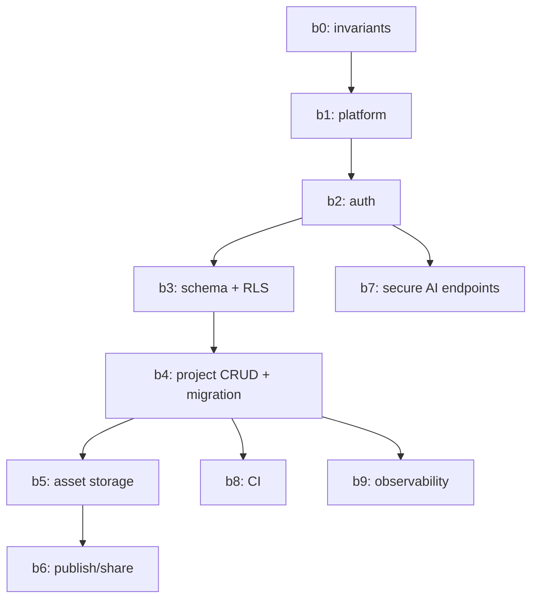

## Goals (MVP)

- **Accounts**: users can sign in and their work follows them across devices.
- **Cloud projects**: projects are stored server-side (still represented as the existing `Project` JSON).
- **Cloud assets**: 3D model binaries are stored in object storage and referenced from projects.
- **Real publishing**: “publish/share” generates a link that works for other people/devices.
- **AI stays server-side**: OpenAI keys never reach the browser.
- **Security-first**: backend is safe even when modified by future AI agents.
- **Simplicity**: minimal moving parts; avoid premature enterprise features.

## Non-goals (for now)

- Teams / org workspaces / sharing permissions beyond “public link”
- Billing/subscriptions
- Real-time collaboration
- Complex offline sync (keep a simple path; revisit later)

## Current State (baseline)

- Frontend-only app with local persistence:
  - Projects saved to IndexedDB (`Project` includes `objects` + `steps` + `thumbnail`).
  - Model assets stored locally (separate IndexedDB store).
  - Starter models are bundled with the app and seeded into IndexedDB with deterministic IDs
    (e.g. `starter:cube`) from `src/starterAssets/models/*`.
- A single production API endpoint:
  - Vercel Edge: `POST /api/ai/extract-steps` (`api/ai/extract-steps.ts`)
  - Local dev mirror: Express at `dev-server/devApi.mjs`
  - Vite proxies `/api/*` to the dev server (`vite.config.ts`)
- Publish is currently local-only:
  - `src/utils/publishUtils.ts` generates `.../published?projectId=...` and warns it won’t work cross-device.

## Planning Artifacts (keep updated)

- **Development coordination plan (tasks)**: `.cursor/plans/backend_mvp_coordination_61a0f4d2.plan.md`
  - 17 discrete tasks (B1–B17) with dependencies, file lists, deliverables, and status tracking
  - This is the **primary task-assignment document** for AI agents
- **Security rules**: `.cursor/rules/backend-security.mdc`
- **ADRs**: `docs/adr/`
- **Preflight checklist**: `BACKEND_MVP_CHECKLIST.md`

## Recommended MVP Architecture (simple + robust)

### Recommendation

Use **Supabase** for:
- **Auth** (user accounts, OAuth later)
- **Postgres** (projects metadata + JSON project data, published records)
- **Storage** (3D model files + thumbnails) with bucket policies
- **Row Level Security (RLS)** as the primary guardrail against data leaks

Keep **Vercel** for:
- Hosting the frontend (already)
- Serverless/Edge functions for AI endpoints and any privileged operations

### Why this fits an AI-managed codebase

- **RLS makes data leaks hard**: even if an agent writes a buggy query, the DB enforces access control.
- **One platform, fewer moving parts**: reduces infra complexity and “unknown unknowns.”
- **TypeScript everywhere**: consistent mental model and shared types.

### Acceptable alternative (if avoiding Supabase)

- Managed Postgres (Neon/RDS) + Auth provider (Clerk/Auth0) + S3/R2 + custom API.
- This is more infrastructure and more opportunity for AI agents to misconfigure security.

## Security Model (AI-managed guardrails)

### Threat model (practical)

- **External attackers**: brute force auth, scrape public endpoints, abuse AI endpoints, attempt IDOR.
- **Malicious/curious users**: tamper with client requests, try to access other users’ projects/assets.
- **Accidental regressions by AI agents**: missing auth checks, using service-role secrets in the client, skipping validation, overly permissive RLS.

### Invariants (must remain true)

1. **No secrets in the browser**
   - Never expose OpenAI keys, DB passwords, or Supabase service role keys client-side.
2. **All user data access is enforced by RLS**
   - Do not rely on “frontend filters” or “API checks” alone.
3. **All external inputs are validated**
   - Every API route has schema validation; reject unknown/invalid shapes early.
4. **Uploads are direct-to-storage with policies**
   - Avoid proxying large binaries through your app server when possible.
5. **Published links are least-privilege**
   - “Public view” gets only what it needs; no edit access.

## Data Model (maps to existing TypeScript types)

### Existing frontend types (source of truth)

- `Project`: `src/types/project.ts`
  - `objects: SceneObject[]`
  - `steps: SimStep[]`
  - `thumbnail?: string` (today: base64; backend should prefer URL)
- `SceneObject`, `SimStep`: `src/types.ts`
- Assets metadata: `src/types/model.ts`

### Backend representation (MVP)

Store the project as JSON to keep the backend simple and aligned with the app:

- **projects**
  - `id (uuid)`
  - `owner_id (uuid)` (FK → users)
  - `name (text)`
  - `data (jsonb)` — the serialized `Project` content excluding big binaries
  - `thumbnail_url (text, nullable)`
  - `created_at, updated_at`
  - `deleted_at` (soft delete)

For assets:

- **assets**
  - `id (uuid)`
  - `owner_id (uuid)`
  - `project_id (uuid, nullable)` (assets may be reused later)
  - `storage_key (text)` — path in storage bucket
  - `filename, file_type, file_size`
  - `metadata (jsonb)` — optional: bounding boxes, child meshes, etc.
  - `created_at`

#### Starter models (important MVP simplification)

Starter models are **not user uploads**. For MVP, keep them **app-bundled** (as they are today)
and **do not store them in the `assets` table**.

- Projects may reference starter assets by deterministic IDs like `starter:<slug>`.
- Rendering a project (including published snapshots) should resolve `starter:*` IDs to the
  bundled starter asset URLs.
- Cloud migration should **skip uploading starter assets** (only upload user assets).

For publishing:

- **published_projects**
  - `id (uuid)`
  - `project_id (uuid)`
  - `share_token (text unique)` — unguessable, treated as secret
  - `snapshot (jsonb)` — optional snapshot at publish time (simplest/robust)
  - `created_at, updated_at`
  - `is_active (boolean)`

### MVP decision: snapshot vs live publish

- **Snapshot publish (recommended MVP)**:
  - Publishing creates a frozen copy of the project JSON.
  - Pros: stable links, fewer edge cases, simpler security.
  - Cons: republish required to update.
- **Live publish (later)**:
  - Published link reads current project state.
  - Pros: always up-to-date.
  - Cons: more permission complexity.

## API Surface (MVP)

### Simplest approach (recommended first)

Use **Supabase client** in the frontend for project CRUD and storage operations, relying on:
- Auth session (user token)
- RLS policies for access control

Keep custom API routes only for:
- AI endpoints (OpenAI proxy)
- Any privileged operations that must not run client-side

This minimizes custom backend code and keeps the system elegant.

### Endpoints (initial)

- `POST /api/ai/extract-steps`
  - Add auth requirement when accounts exist (or at least rate limiting + abuse protection).
- Optional thin API layer (only if needed later):
  - `GET/POST/PUT/DELETE /api/projects/...`
  - `POST /api/publish`
  - These are not required if using Supabase directly with RLS.

## Implementation Phases (plan of attack)

### Phase 0 — Foundations (security + clarity)

**Outcome**: future agents cannot accidentally “make it insecure.”

- Define invariants (above) and codify them in `.cursor/rules/` (see task `b0-invariants`).
- Decide whether project CRUD is direct-to-Supabase or via thin API (recommend direct for MVP).

### Phase 1 — Auth + Cloud Projects (biggest impact)

**Outcome**: users can sign in and projects persist across devices.

- Supabase Auth (email/password; OAuth optional later).
- `projects` table + RLS:
  - owner-only access by default.
  - list endpoint returns metadata; full project fetch returns full JSON.
- Frontend:
  - Keep IndexedDB as a fallback initially (or as a one-time migration tool).
  - Provide “Import local projects to cloud” flow.

### Phase 2 — Cloud Assets

**Outcome**: model uploads are stored server-side; projects reference them.

- Storage bucket(s) for:
  - `models/`
  - `thumbnails/`
- Enforce:
  - size limits
  - file type allowlists
  - user-scoped paths (e.g. `userId/projectId/...`)
- Frontend:
  - replace local asset persistence with cloud references
  - continue to support existing local projects via migration

### Phase 3 — Real Publish/Share

**Outcome**: published link works for other devices/users.

- Replace the current local-only publish URL generator in `src/utils/publishUtils.ts`:
  - generate a share token server-side
  - load published snapshot by token in the published viewer route
- Decide access:
  - public view allowed without auth
  - no editing; no private data beyond simulation content

### Phase 4 — Secure AI endpoints

**Outcome**: AI features are protected from abuse and cost explosions.

- Require auth (or at minimum: strong rate limiting + bot protection).
- Rate limits:
  - per-user
  - per-IP fallback
- Logging:
  - request ids
  - latency
  - model + token usage (if available)

### Phase 5 — CI + Observability (minimal but real)

**Outcome**: AI agents can’t silently ship breaking changes.

- CI:
  - typecheck/lint/test for frontend (already standard)
  - add backend checks once backend exists
  - add a small set of integration tests for auth/project/publish
- Observability:
  - error tracking (Sentry or equivalent)
  - basic metrics: endpoint error rate, latency, AI call count

## Task Dependency Graph



## Agent Handoff Template (for future backend work)

Use this when assigning backend tasks to an AI agent:

```
Task: bX - <task name>

Reference:
- This plan: .cursor/plans/backend_mvp_plan_9d2b1c3e.plan.md

Constraints:
- Keep it minimal and elegant (MVP).
- No teams/billing/realtime collaboration.
- Security invariants must remain true.

Deliverables:
- <exact files/DB objects/endpoints>

Guardrails:
- No secrets in client.
- RLS must enforce access.
- Validate all inputs.
```

## “Done” Definition (MVP backend)

- A user can sign in on a second device and see the same projects.
- Projects and assets are stored server-side with clear ownership.
- Published links work across devices and are view-only.
- AI endpoint is protected from casual abuse and cost blowups.
- There are enough automated checks that regressions are caught quickly.

