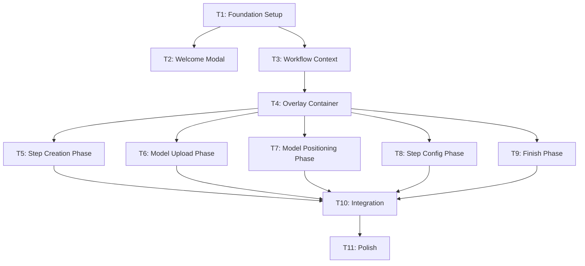

# Guided Workflow - Development Coordination Plan

## How to Use This Plan

This plan divides the Guided Workflow feature into discrete tasks. Each task:

- Has a **clear scope** with specific files to create/modify
- Lists **dependencies** that must be completed first
- Defines **deliverables** - what "done" looks like
- Provides **context** an agent needs to pick up the work

When starting a task, tell the agent:

1. Reference this plan file
2. Specify which task to work on
3. Point to any completed dependencies

---

## UX guardrails (must follow for every task)

Use the same design principles established during Step Creation:

- See `.cursor/rules/guided-workflow.mdc` → **Guided Workflow UX guardrails**.
- Keep guided workflow UI minimal and premium: one clear goal per screen, one-line “why” explanation, card-style choice buttons, persistent `Skip setup`, and stable layouts that scroll internally.

---

## Task Dependency Graph




---

## Task Breakdown

### T1: Foundation Setup

**Priority**: First  
**Estimated Complexity**: Low  
**Dependencies**: None

**Scope**:

- Create folder structure for guided workflow components
- Create TypeScript type definitions
- Add any shared constants

**Files to Create**:

```
src/types/guidedWorkflow.ts
src/components/guidedWorkflow/.gitkeep (or index.ts barrel)
```

**Deliverables**:

```typescript
// src/types/guidedWorkflow.ts
export type GuidedWorkflowPhase = 
  | 'welcome'
  | 'step-creation'
  | 'model-upload'
  | 'model-positioning'
  | 'step-configuration'
  | 'finish';

export type StepCreationMethod = 'sop' | 'manual' | null;

export interface GuidedWorkflowState {
  isActive: boolean;
  currentPhase: GuidedWorkflowPhase;
  currentStepIndex: number;
  pendingSteps: string[];
  creationMethod: StepCreationMethod;
}

export interface GuidedWorkflowActions {
  startWorkflow: () => void;
  skipToEditor: () => void;
  nextPhase: () => void;
  previousPhase: () => void;
  setCurrentStepIndex: (index: number) => void;
  setPendingSteps: (steps: string[]) => void;
  setCreationMethod: (method: StepCreationMethod) => void;
  exitWorkflow: () => void;
}
```

**Context for Agent**:

- Reference [STYLE_GUIDE.md](STYLE_GUIDE.md) for naming conventions
- Look at existing types in `src/types.ts` for patterns
- Keep types generic enough to support future phases

---

### T2: Welcome Modal

**Priority**: High (entry point)  
**Estimated Complexity**: Medium  
**Dependencies**: T1 (Foundation Setup)

**Scope**:

- Create WelcomeModal component
- Two buttons: "Guided Setup" (primary), "Start from Scratch" (secondary)
- Follow modal patterns from `PublishModal.tsx`
- Do NOT integrate into EditorPage yet (T10 will do that)

**Files to Create**:

```
src/components/guidedWorkflow/WelcomeModal.tsx
```

**Files to Reference**:

- `src/components/PublishModal.tsx` - modal structure, focus trap, accessibility
- `src/components/GlobalPopup.tsx` - animation patterns
- `STYLE_GUIDE.md` - glass panel styling

**Deliverables**:

- Modal with backdrop blur
- Title: "Create Your Simulation" (or similar)
- Two-button layout with clear visual hierarchy
- Proper focus management and keyboard handling
- Props for `isOpen`, `onSelectGuided`, `onSelectEditor`

**UI Specification**:

```
+------------------------------------------+
|                                          |
|        Create Your Simulation            |
|                                          |
|   Create immersive training experiences  |
|   for your team with guided setup or     |
|   jump straight into the editor.         |
|                                          |
|   +----------------------------------+   |
|   |  [icon]  Guided Setup            |   |
|   |  Recommended for new users       |   |
|   +----------------------------------+   |
|                                          |
|   +----------------------------------+   |
|   |  [icon]  Start from Scratch      |   |
|   |  For experienced users           |   |
|   +----------------------------------+   |
|                                          |
+------------------------------------------+
```

---

### T3: Workflow Context

**Priority**: High (state management)  
**Estimated Complexity**: Medium  
**Dependencies**: T1 (Foundation Setup)

**Scope**:

- Create React Context for guided workflow state
- Create custom hook for consuming context
- Handle persistence to localStorage or project metadata

**Files to Create**:

```
src/contexts/GuidedWorkflowContext.tsx
src/hooks/useGuidedWorkflow.ts
```

**Files to Reference**:

- `src/contexts/PopupContext.tsx` - context pattern
- `src/hooks/useProjects.ts` - persistence patterns

**Deliverables**:

- `GuidedWorkflowProvider` component
- `useGuidedWorkflow` hook returning state + actions
- Phase navigation logic (next/previous)
- Persistence of workflow state (survives page refresh)

**Key Functions**:

```typescript
// Context value shape
interface GuidedWorkflowContextValue {
  state: GuidedWorkflowState;
  actions: GuidedWorkflowActions;
  // Computed helpers
  isFirstPhase: boolean;
  isLastPhase: boolean;
  canProceed: boolean; // Phase-specific validation
}
```

---

### T4: Overlay Container

**Priority**: High (routing)  
**Estimated Complexity**: Medium  
**Dependencies**: T3 (Workflow Context)

**Scope**:

- Create main overlay container component
- Route to correct phase component based on state
- Provide consistent layout/chrome for all phases
- Progress indicator showing current phase (low cognitive load)
- Acts as the **primary UI shell in guided mode** (editor chrome hidden)

**Files to Create**:

```
src/components/guidedWorkflow/GuidedWorkflowOverlay.tsx
src/components/guidedWorkflow/PhaseIndicator.tsx
```

**Deliverables**:

- Overlay/shell that renders over the editor canvas while **editor chrome is hidden**
- Phase routing (switch statement or mapping)
- Consistent header and a subtle progress indicator
- Exit button to leave workflow early
- Renders placeholder content for each phase (actual content in T5-T9)

**Progress UI (Low Cognitive Load)**:

- Do NOT list all phase names during the workflow.
- Use a subtle, **unlabeled** progress rail (dots/segments) fixed to the **bottom of the screen**.

**Guided Mode UI Gating (Critical)**:

- The 3D canvas remains visible in guided mode.
- In guided mode, hide editor-mode UI that is not required for the current phase:
  - `TopBar` (title, preview/publish, etc.)
  - `LeftSidebar` / `RightSidebar` (unless explicitly reintroduced for a phase)
  - Debug/help chrome (unless a phase requires it)
- Prefer reusing **logic and hooks** from editor behaviors, but present them in **guided-specific panels** so we control what the user sees.

**Component Structure**:

```tsx
<GuidedWorkflowOverlay>
  <PhaseIndicator currentPhase={phase} />
  <div className="phase-content">
    {phase === 'step-creation' && <StepCreationPhase />}
    {phase === 'model-upload' && <ModelUploadPhase />}
    {/* etc */}
  </div>
  <div className="phase-navigation">
    <Button onClick={previousPhase}>Back</Button>
    <Button onClick={nextPhase}>Continue</Button>
  </div>
</GuidedWorkflowOverlay>
```

---

### T5: Step Creation Phase

**Priority**: Medium  
**Estimated Complexity**: High  
**Dependencies**: T4 (Overlay Container)

**Scope**:

- UI for SOP upload (file dropzone)
- UI for manual step creation
- Toggle between upload and manual modes
- Step list preview/confirmation
- NOTE: AI/SOP processing is a future enhancement - for now, manual only

**Files to Create**:

```
src/components/guidedWorkflow/phases/StepCreationPhase.tsx
src/components/guidedWorkflow/phases/SOPUploadSection.tsx (placeholder)
src/components/guidedWorkflow/phases/ManualStepCreation.tsx
```

**Files to Reference**:

- `src/components/leftSidebar/StepsPanel.tsx` - step list patterns
- `src/components/leftSidebar/AddPanel.tsx` - file upload UI

**Deliverables**:

- Two-path UI: "Upload SOP" vs "Create Manually"
- Manual path: Simple form to add step titles
- Step list showing added steps with edit/delete
- Confirm button to proceed with created steps

**MVP Scope** (for first pass):

- Manual step creation only
- SOP upload can be a disabled/placeholder button with "Coming Soon"

---

### T6: Model Upload Phase

**Priority**: Medium  
**Estimated Complexity**: Low  
**Dependencies**: T4 (Overlay Container)

**Scope**:

- Instructional content explaining model upload
- Show/highlight existing AddPanel upload area
- List of uploaded models
- Continue button enabled when at least 1 model exists

**Files to Create**:

```
src/components/guidedWorkflow/phases/ModelUploadPhase.tsx
```

**Files to Reference**:

- `src/components/leftSidebar/AddPanel.tsx` - existing upload
- `src/hooks/useModelUpload.ts` - existing hook

**Deliverables**:

- Instructional overlay explaining what to do
- Integration with existing upload functionality (don't recreate)
- Model list showing what's been uploaded
- Validation: require at least one model to proceed

**Implementation Note**:
This phase should NOT recreate upload UI - it should guide users to the existing AddPanel. The overlay provides context, the actual interaction uses existing components.

---

### T7: Model Positioning Phase

**Priority**: Medium  
**Estimated Complexity**: Low  
**Dependencies**: T4 (Overlay Container)

**Scope**:

- Instructional overlay for positioning
- User interacts with existing editor tools
- Minimal new UI - mostly guidance

**Files to Create**:

```
src/components/guidedWorkflow/phases/ModelPositioningPhase.tsx
```

**Files to Reference**:

- `src/components/RightSidebar.tsx` - transform controls
- `src/components/MainCanvas.tsx` - 3D interaction

**Deliverables**:

- Instructional content explaining positioning tools
- Highlight/point to existing controls
- "I'm done positioning" confirmation button
- Optional: Quick tips about keyboard shortcuts

**Design Principle**:
This is the most "teaching" focused phase - users interact with real editor tools while guided overlay explains what they're doing.

---

### T8: Step Configuration Phase

**Priority**: High (most complex)  
**Estimated Complexity**: High  
**Dependencies**: T4 (Overlay Container)

**Scope**:

- Loop through each step from Phase 1
- Show step context (number, title)
- Step type selection (reuse existing components)
- Step type configuration (reuse existing components)
- Navigation between steps

**Files to Create**:

```
src/components/guidedWorkflow/phases/StepConfigurationPhase.tsx
src/components/guidedWorkflow/components/StepContextDisplay.tsx
```

**Files to Reference (CRITICAL)**:

- `src/components/stepCard/StepTypeSection.tsx` - **reuse directly**
- `src/components/stepCard/InfoCardSection.tsx` - **reuse directly**
- `src/components/stepCard/MoveItemSection.tsx` - **reuse directly**
- `src/components/stepCard/constants.ts` - step type definitions

**Deliverables**:

- Step context display (Step 1 of N: "Step Title")
- Embedded StepTypeSection for type selection
- Embedded type-specific section for configuration
- Per-step navigation (Previous Step / Next Step)
- Progress within phase (1/5, 2/5, etc.)

**Critical Implementation Notes**:

```tsx
// DO reuse existing components:
import { StepTypeSection } from '../stepCard/StepTypeSection';
import { InfoCardSection } from '../stepCard/InfoCardSection';
import { MoveItemSection } from '../stepCard/MoveItemSection';

// DON'T create new step type UI - this ensures future step types
// automatically work in both guided workflow and editor
```

---

### T9: Finish Phase

**Priority**: Low  
**Estimated Complexity**: Low  
**Dependencies**: T4 (Overlay Container)

**Scope**:

- Completion/success screen
- Summary of what was created
- Transition to editor button

**Files to Create**:

```
src/components/guidedWorkflow/phases/FinishPhase.tsx
```

**Deliverables**:

- Congratulatory message
- Summary: X steps created, Y models added
- "Start Editing" button
- Marks workflow as complete

**UI Specification**:

```
+------------------------------------------+
|                                          |
|           Setup Complete! [checkmark]    |
|                                          |
|   You've created a simulation with:      |
|   - 5 steps configured                   |
|   - 3 models positioned                  |
|                                          |
|   You can now use the full editor to     |
|   refine your simulation.                |
|                                          |
|        [ Start Editing ]                 |
|                                          |
+------------------------------------------+
```

---

### T10: Integration

**Priority**: Required  
**Estimated Complexity**: Medium  
**Dependencies**: T2, T5, T6, T7, T8, T9 (all phase components)

**Scope**:

- Wire WelcomeModal into EditorPage
- Wire GuidedWorkflowOverlay into EditorPage
- Connect workflow actions to actual editor mutations
- Handle workflow exit/resume

**Files to Modify**:

```
src/pages/EditorPage.tsx
```

**Deliverables**:

- New project detection triggers WelcomeModal
- Workflow state controls overlay visibility
- Phase components can call editor handlers (addStep, uploadFile, etc.)
- Workflow completion hides overlay and enters editor mode

**Integration Points in EditorPage**:

```tsx
// Add provider
<GuidedWorkflowProvider>
  <EditorPageContent />
</GuidedWorkflowProvider>

// In EditorPageContent:
const { state, actions } = useGuidedWorkflow();

// Show welcome modal for new projects
{isNewProject && !state.isActive && (
  <WelcomeModal
    isOpen={showWelcome}
    onSelectGuided={actions.startWorkflow}
    onSelectEditor={() => setShowWelcome(false)}
  />
)}

// Show workflow overlay when active
{state.isActive && (
  <GuidedWorkflowOverlay
    onAddStep={handleAddStep}
    onUploadAsset={handleUploadAsset}
    // ... pass existing handlers
  />
)}
```

---

### T11: Polish

**Priority**: Final  
**Estimated Complexity**: Medium  
**Dependencies**: T10 (Integration)

**Scope**:

- Animations and transitions between phases
- Edge case handling (empty states, errors)
- Progress persistence and resume
- Accessibility audit
- User testing feedback

**Deliverables**:

- Smooth phase transitions
- Error handling for all phases
- Resume workflow on project re-open
- Keyboard navigation throughout
- Screen reader compatibility

---

## Parallel Work Opportunities

These tasks can be worked on simultaneously:

**After T1 is complete**:

- T2 (Welcome Modal) and T3 (Context) can run in parallel

**After T4 is complete**:

- T5, T6, T7, T8, T9 can theoretically run in parallel
- However, T8 (Step Config) is complex and may need more attention

**Recommended Parallel Groups**:

1. **Group A**: T5 (Step Creation) + T6 (Model Upload)
2. **Group B**: T7 (Model Positioning) + T9 (Finish)
3. **Solo**: T8 (Step Configuration) - most complex, deserves focus

---

## Agent Handoff Template

When assigning a task to an agent, use this template:

```
Task: [Task ID and Name]

Reference Plans:
- Main feature plan: [path to guided_workflow_feature plan]
- This coordination plan: [path to this file]

Dependencies Completed:
- [List completed dependencies and their locations]

Your Scope:
- [Copy the "Scope" section for this task]

Files to Create/Modify:
- [Copy the file list]

Key References:
- [Copy the "Files to Reference" section]

Deliverables:
- [Copy the deliverables]

Notes:
- Follow STYLE_GUIDE.md for all UI components
- Use existing patterns from referenced files
- Do not modify files outside your scope
```

---

## Success Criteria

The Guided Workflow feature is complete when:

1. New projects show WelcomeModal with two options
2. "Guided Setup" enters the workflow, "Start from Scratch" enters editor
3. All 5 phases work sequentially (welcome handled by modal)
4. Step types from guided workflow match editor step types exactly
5. User can exit workflow early and resume later
6. Completing workflow transitions smoothly to editor
7. All UI follows STYLE_GUIDE.md patterns
8. Keyboard and screen reader accessible
