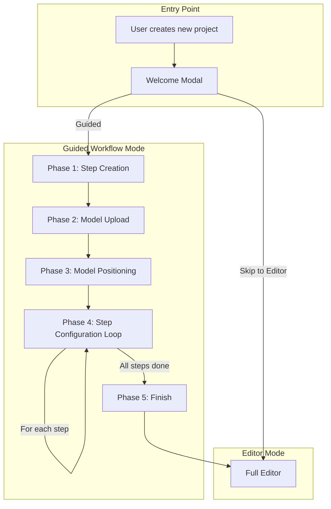
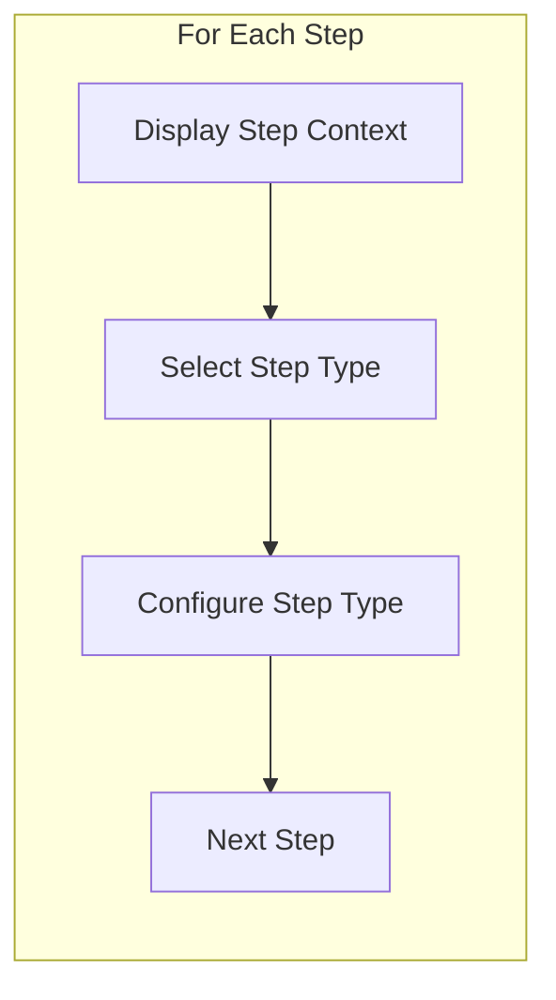

# Guided Workflow Feature Plan

## Overview

This feature adds a guided, linear workflow to Facilitate Studio for new users creating projects. The workflow guides users through:

1. SOP upload or manual step creation
2. Model upload and positioning
3. Step-by-step configuration (assigning step types)
4. Transition to the full editor

The key principle is that the guided workflow **secretly teaches users to use the editor** by using familiar UI patterns and interactions. When users finish the workflow, they should feel comfortable using the editor independently.

---

## Architecture Overview




---

## Phase 1: Welcome Modal

### Purpose

Funnel users into the guided workflow or allow advanced users to skip directly to the editor.

### Location

- New component: `src/components/WelcomeModal.tsx`
- Triggered in `EditorPage.tsx` when a new project is created (no existing content)

### UI Design

- Centered modal following the glass panel aesthetic
- Title: "Create Your Simulation" or similar welcoming copy
- Two options:
  - **Guided Setup** (recommended) - Primary button with description: "Follow a step-by-step process to create your simulation"
  - **Start from Scratch** - Secondary button: "Jump straight to the editor"
- Clean, minimal design consistent with [STYLE_GUIDE.md](STYLE_GUIDE.md)

### State

- Store user's choice in project metadata or local storage
- Track if project has completed guided workflow (for re-opening)

---

## Phase 2: Step Creation

### Purpose

User uploads an SOP document or manually creates simulation steps.

### UI Components

- Overlay/panel that guides the user through step creation
- Reuses existing `StepsPanel.tsx` patterns where possible
- Two paths:
  - **SOP Upload**: File dropzone, document processing, AI step extraction
  - **Manual Creation**: Add steps one by one using existing step card UI

### Key Files to Reference

- Phoenix A2: `src/ui/screens.ts` (learning_v3b screen)
- Existing: `src/components/leftSidebar/StepsPanel.tsx`

### Implementation Notes

- SOP processing will require new API integration (AI extraction)
- Manual step creation reuses existing `handleAddStep` from `EditorPage.tsx`
- Steps are created with `type: null` initially (like current behavior)

---

## Phase 3: Model Upload

### Purpose

User uploads 3D models for the simulation.

### UI Components

- Focused view highlighting the Add panel's upload functionality
- Model list showing uploaded models with focus/delete options
- "Continue" button when at least one model exists

### Key Files

- Existing: `src/components/leftSidebar/AddPanel.tsx`
- Existing: `src/hooks/useModelUpload.ts`

### Implementation Notes

- Reuse existing upload infrastructure entirely
- Guided overlay explains what to do, but actual upload uses existing UI
- This teaches users where the upload functionality lives in the editor

---

## Phase 4: Model Positioning

### Purpose

User positions uploaded models in the 3D scene.

### UI Components

- Instructional overlay explaining positioning
- Full access to translate/rotate/scale tools (existing)
- Uses existing `RightSidebar.tsx` for transform controls
- "Continue" button when user confirms positions

### Key Files

- Existing: `src/components/RightSidebar.tsx`
- Existing: `src/components/MainCanvas.tsx`

### Implementation Notes

- Minimal UI additions - mostly instructional overlays
- Users interact with the same tools they'll use in editor mode
- Critical for "teaching through doing" principle

---

## Phase 5: Step Configuration (Per-Step Loop)

### Purpose

For each step created in Phase 2, user assigns a step type and configures it.

### Flow




### UI Components

- **Step Context Display**: Shows current step number and title (like Phoenix A2's `createV3BStepContextBox`)
- **Step Type Selection**: Uses existing `StepTypeSection.tsx` component
- **Step Configuration**: Uses existing `InfoCardSection.tsx` or `MoveItemSection.tsx`

### Key Files

- Existing: `src/components/stepCard/StepTypeSection.tsx`
- Existing: `src/components/stepCard/InfoCardSection.tsx`
- Existing: `src/components/stepCard/MoveItemSection.tsx`
- Existing: `src/components/stepCard/constants.ts` (STEP_TYPES array)

### Implementation Notes

- **Reuse step type components directly** - this is critical for consistency
- Step types are defined in `src/types.ts` (`StepType = 'info-card' | 'move-item'`)
- Future step types added to `StepType` union will automatically appear in both places
- For move-item steps, use existing "Record Position" workflow

---

## Phase 6: Finish and Transition

### Purpose

Complete the guided workflow and transition to full editor mode.

### UI Components

- Completion modal/overlay with congratulatory message
- Summary of what was created
- "Start Editing" button to enter editor mode

### Implementation Notes

- Mark project as having completed guided workflow
- Ensure all step data is properly saved before transition
- Possibly show a brief "tour" of editor features user hasn't seen

---

## State Management

### New State Requirements

```typescript
// src/types/guidedWorkflow.ts (new file)

interface GuidedWorkflowState {
  /** Whether guided workflow is active */
  isActive: boolean;
  /** Current phase of the workflow */
  currentPhase: GuidedWorkflowPhase;
  /** For step configuration phase: current step index */
  currentStepIndex: number;
  /** Steps extracted from SOP (before confirmation) */
  pendingSteps: string[];
  /** Whether SOP was used or manual entry */
  creationMethod: 'sop' | 'manual' | null;
}

type GuidedWorkflowPhase = 
  | 'welcome'
  | 'step-creation'
  | 'model-upload'
  | 'model-positioning'
  | 'step-configuration'
  | 'finish';
```

### Storage Strategy

- Use React Context for workflow state (like `PopupContext`)
- Persist phase to project metadata or localStorage for resume capability
- Reuse existing undo/redo system for all actual data changes

### Key Files

- New: `src/contexts/GuidedWorkflowContext.tsx`
- New: `src/hooks/useGuidedWorkflow.ts`

---

## File Structure (New Files)

```
src/
├── components/
│   ├── guidedWorkflow/
│   │   ├── WelcomeModal.tsx
│   │   ├── GuidedWorkflowOverlay.tsx (main container)
│   │   ├── StepCreationPhase.tsx
│   │   ├── ModelUploadPhase.tsx
│   │   ├── ModelPositioningPhase.tsx
│   │   ├── StepConfigurationPhase.tsx
│   │   ├── FinishPhase.tsx
│   │   ├── StepContextDisplay.tsx (shows current step being configured)
│   │   └── PhaseIndicator.tsx (progress indicator)
│   └── ...existing
├── contexts/
│   ├── GuidedWorkflowContext.tsx
│   └── ...existing
├── hooks/
│   ├── useGuidedWorkflow.ts
│   └── ...existing
└── types/
    ├── guidedWorkflow.ts
    └── ...existing
```

---

## Integration Points

### EditorPage.tsx Modifications

- Detect new project creation (no existing content)
- Conditionally render `GuidedWorkflowOverlay` when workflow is active
- Pass existing handlers to workflow components (they should use the same mutation functions)

### Step Types Extensibility

The step type system is already extensible:

1. Add new type to `StepType` union in `src/types.ts`
2. Add config to `STEP_TYPES` in `src/components/stepCard/constants.ts`
3. Create section component (e.g., `NewTypeSection.tsx`)
4. Update `StepCardView.tsx` to render new section

**These changes automatically apply to both guided workflow and editor** because the guided workflow uses the same step card components.

---

## Key Design Principles

1. **Reuse, Don't Recreate**: Use existing components wherever possible
2. **Teach Through Doing**: Users learn the same concepts they’ll use in the editor, but guided mode can present them in a simplified, purpose-built UI
3. **Consistent UI**: Follow STYLE_GUIDE.md exactly for new components
4. **Graceful Exit**: Users can exit guided mode at any time and resume later
5. **State Preservation**: All changes use the existing undo/redo system
6. **Future-Proof**: Step types automatically sync between guided and editor modes

### UX guardrails (apply to every guided phase)

- **No confusion**: each phase must include a single simple line explaining what’s happening and why the user is doing it.
- **Minimal, premium UI**: one clear decision/action per screen; avoid redundant headings and over-explaining.
- **Choice screens use card buttons**: entire option cards are clickable (WelcomeModal pattern), with clear primary/recommended vs secondary styling.
- **Persistent `Skip setup`**: fixed bottom-left, outside the panel, always available; avoid “editor” terminology in user-facing copy.
- **Focused layout**: center “setup” panels when they’re the primary task (especially at the start of the workflow).
- **Lock 3D navigation when not needed**: disable camera/keyboard navigation during phases that don’t require scene interaction.
- **Scale gracefully**: lists must scroll within their own region (panel height stays stable); ensure visual spacing so panels don’t crowd the bottom progress indicator.
- **Mirror editor interactions**: reuse editor patterns (StepsPanel feel, reorder affordances, etc.) so guided setup trains users for the full workflow.
- **Accessibility**: semantic controls, `aria-label`s for icon buttons, keyboard-friendly flows by default.

### Guided Mode UI Gating (Critical)

- **The 3D canvas is always visible** as the background/backdrop in both guided mode and editor mode.
- **All panels/toolbars are modular UI** that can be shown/hidden depending on what the user needs for the current mode + phase.
- In **Guided Setup**, we should **remove editor-mode stimulus**:
  - Hide `TopBar` (simulation title, preview, publish, undo/redo, etc.)
  - Hide `LeftSidebar` and `RightSidebar` unless a specific guided phase explicitly requires a focused subset of those controls
  - Hide debug / help chrome that isn’t necessary for the current guided phase
- Guided mode should show **only**:
  - The minimal guided workflow panels for the current phase (instructions + required controls)
  - Phase progress + back/continue controls
  - An exit action (return to editor mode)

### Progress UI (Low Cognitive Load)

- Avoid listing upcoming phases with labels (e.g. no “Welcome / Steps / Models / …” chips).
- Use a **non-verbal progress rail**:
  - Subtle dots/segments only (no labels)
  - Current dot highlighted; completed dots optionally filled
- Place it at the **bottom of the screen**, centered, and visually quiet so it does not steal focus from the current task.

---

## Implementation Order

The recommended implementation order for future sessions:

1. **Welcome Modal** - Entry point and decision funnel
2. **GuidedWorkflowContext** - State management infrastructure
3. **GuidedWorkflowOverlay** - Main container with phase routing
4. **Step Creation Phase** - SOP upload or manual step creation
5. **Model Upload Phase** - Guided model addition
6. **Model Positioning Phase** - Guided positioning with existing tools
7. **Step Configuration Phase** - Per-step type assignment (most complex)
8. **Finish Phase** - Transition to editor
9. **Polish** - Progress indicators, animations, edge cases

---

## References

### Phoenix A2 Key Patterns to Adapt

- Screen lifecycle with `onEnter`/`onLeave` hooks
- Step context box showing current step being configured
- Storage manager pattern for step data
- Integration manager for converting setup data to editor format

### Facilitate Studio Patterns to Use

- Modal pattern from `PublishModal.tsx`
- Glass panel styling from STYLE_GUIDE.md
- Step card components from `src/components/stepCard/`
- Undo/redo command pattern from `src/hooks/useUndoRedo.ts`
