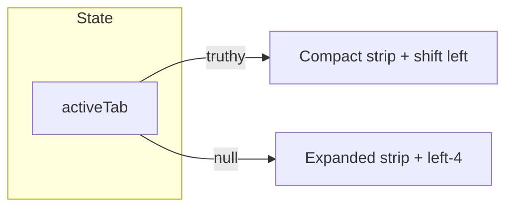

## Goal

When any panel is open (Add, Objects, or Steps), the left strip becomes a minimal icon-only bar and the entire left block moves closer to the viewport edge so the center editor has more room. When the panel is closed, the strip returns to the current expanded look (icons + labels). Transitions should feel smooth and premium.

## Current behavior (reference)

- `src/components/LeftSidebar.tsx`: outer container uses `left-4`, `w-[26rem]` when `activeTab` is set, `w-20` when closed. The nav strip is always `w-20` with three `NavItem` components (icon + label).
- `src/components/leftSidebar/NavItem.tsx`: renders icon and a label ``; no compact mode today.

## Approach

Use **one source of truth**: `activeTab !== null` means “panel open” → use compact strip and tighter left offset. No new global state.

## Implementation

### 1. LeftSidebar container and strip

**File:** `src/components/LeftSidebar.tsx`

- **Left offset:** when `activeTab` is set, use `left-0` or `left-1` instead of `left-4`. When `activeTab` is null, keep `left-4`. Reuse the existing `transition-all duration-500 ease-[cubic-bezier(0.25,0.8,0.25,1)]`.
- **Strip width:** today the strip is always `w-20`. When `activeTab` is set, use a smaller width (e.g. `w-12` or `w-14`) so the strip is icon-only width; when closed, keep `w-20`. Add a transition class to the strip wrapper so width animates smoothly.
- **Pass compact to NavItem:** for each `NavItem`, pass `compact={!!activeTab}` so the strip can render icon-only when a panel is open.

### 2. NavItem compact mode

**File:** `src/components/leftSidebar/NavItem.tsx`

- Add optional prop: `compact?: boolean` (default `false`).
- When `compact` is true:
  - Do not render the visible label `` (or render with `sr-only`).
  - Reduce padding (e.g. `p-2` instead of `p-3`) and optionally icon size (e.g. 20 instead of 22) so the button fits the narrow strip.
- Ensure icon-only remains accessible: set `aria-label={label}` and `title={label}` on the `button` when `compact` is true.

### 3. Tests

- **File:** `src/components/LeftSidebar.test.tsx`  
  - Add/adjust tests so that when `activeTab` is set, the strip reflects compact state (e.g. smaller width class, labels hidden), and when `activeTab` is null, the expanded state remains.

